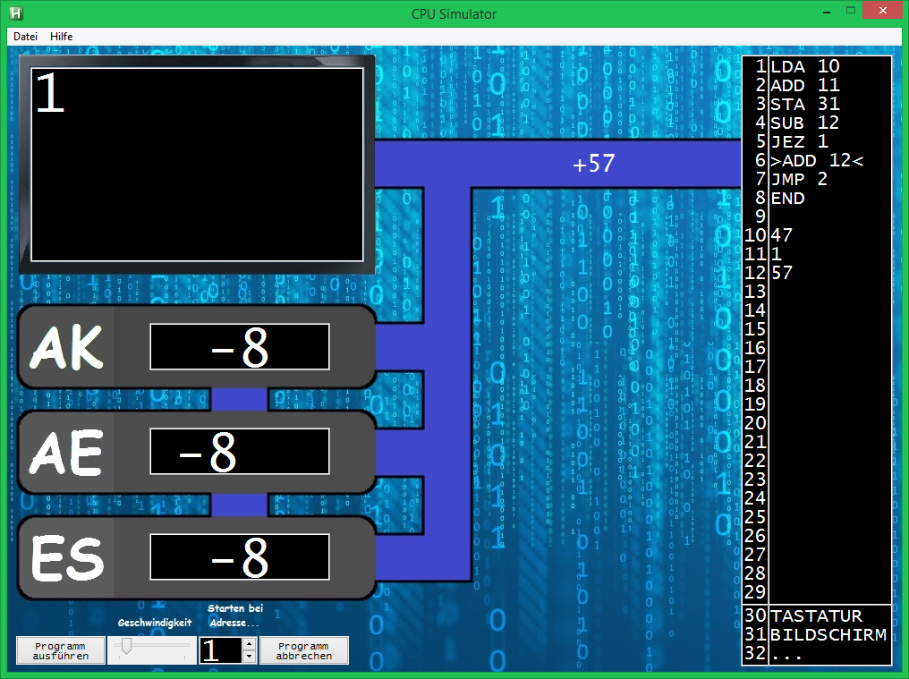

## CPU-Simulator
En: Visualizes/animates the dataflow between RAM and CPU components while running a short assembly program of your choice
De: Visualisiert/animiert den Datenfluss zwischen RAM und den CPU componenten während es ein beliebiges Assemblerprogramm ausführt

#### Assembly documentation:
[Help file](Hilfe.txt)

#### Downloads 
[Downlaod reporsitory](https://github.com/T-vK/CPU-Simulator/archive/master.zip)

#### Screenshots
